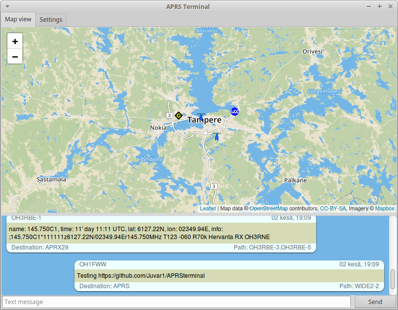

APRS Terminal
=============

A simple Python GUI program to view APRS data from radio via serial port or Bluetooth. Serial port and Bluetooth settings is available in settings panel. Autoscrolling feature is included to program so latest messages are always visible.

### Features
- Graphical user interface for those who not like text only mode.
- Decodes KISS frame
- Decodes ax.25 U frame
- Decodes MIC-E format
- Decodes APRS compressed data formats
- Removes old items from the map
- Removes traces of moving objects on the map

### Supported and tested Hardware
- Supports virtually any TNC which supports real or virtual serial port and KISS protocol.
- Tested with [Mobilinkd TNC2](https://store.mobilinkd.com/) through Bluetooth (with virtual serial port).

### How does it work
Program decodes KISS frame and then ax.25 frame and lastly MIC-E data if available. Result is printed on window with colorful notation.

### HELP - What to do if it does not work somehow?
Program should work on Python version 2.7.xx and onward. Run it with command "sudo python APRSterminal.py" without quotes.
Contact me. I'm willing to help on any questions and can even add some features to program if necessary.
